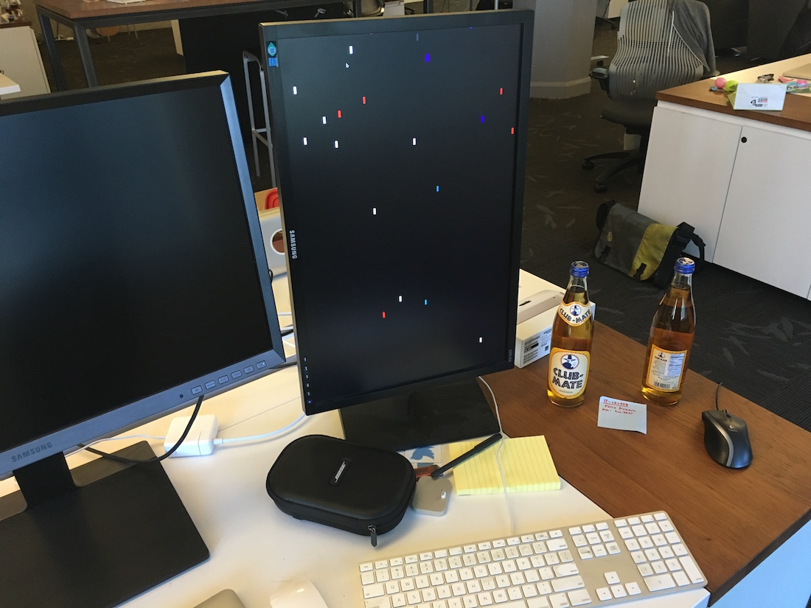

# fasttrack

A real-time visualisation of fastlane launches around the world: [Open link](https://krausefx.github.io/fasttrack/)

Each tool looks for updates when it's launched. The update checker is also open source as [refresher](https://github.com/fastlane/refresher).

A year ago a LED board was used to show the rockets: [fastrockets](https://github.com/krausefx/fastrockets)
